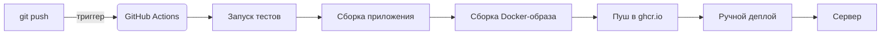

# CI/CD Pipeline для фронтенда (React + Vite + Docker)

Этот документ — краткая шпаргалка по настройке CI/CD для фронтенд-проекта с автодеплоем на VPS (Selectel).

## 📦 Общая схема работы



## 🧠 1. Что такое CI/CD?

**CI (Continuous Integration)** — автоматическая проверка кода после каждого пуша.

| Шаг                    | Команда         | Что делает                                |
| ---------------------- | --------------- | ----------------------------------------- |
| Установка зависимостей | `npm ci`        | Устанавливает пакеты строго по lock-файлу |
| Линтер                 | `npm run lint`  | Проверяет стиль кода                      |
| Тесты                  | `npm run test`  | Запускает unit-тесты                      |
| Сборка                 | `npm run build` | Проверяет, что проект собирается          |

**Цель:** убедиться, что новый код ничего не сломал.

**CD (Continuous Delivery)** — доставка приложения на сервер.

| Аспект           | Как реализовано                           |
| ---------------- | ----------------------------------------- |
| Запуск           | Ручной (по кнопке `workflow_dispatch`)    |
| Что доставляется | Docker-образ из GitHub Container Registry |
| Как              | `docker pull` + `docker run` через SSH    |

---

## 🐳 2. Почему Docker?

| Преимущество     | Объяснение                                  |
| ---------------- | ------------------------------------------- |
| Единое окружение | На сервере не нужны Node.js, npm, nginx     |
| Простота деплоя  | Нужен только Docker                         |
| Версионирование  | Образы хранятся в реестре, легко откатиться |

### Основные понятия Docker

| Понятие      | Объяснение                                           |
| ------------ | ---------------------------------------------------- |
| Dockerfile   | Рецепт сборки образа (многостадийная сборка)         |
| Docker-образ | Готовый "слепок" приложения (хранится в `ghcr.io`)   |
| Контейнер    | Запущенный образ (живёт на сервере)                  |
| Volume       | Папка вне контейнера для данных (фронтенду не нужен) |

---

## 🔐 3. SSH-ключи (самое важное)

SSH нужен для того, чтобы GitHub Actions мог безопасно подключиться к твоему серверу.

### Как это работает

| Тип ключа | Где лежит                             | Можно ли показывать |
| --------- | ------------------------------------- | ------------------- |
| Приватный | Локально + GitHub Secrets             | ❌ НИКОГДА          |
| Публичный | На сервере (`~/.ssh/authorized_keys`) | ✅ Да               |

### Настройка

```bash
# 1. Создать ключ для GitHub Actions
ssh-keygen -t ed25519 -f ~/.ssh/github_actions_key -C "github-actions"

# 2. Положить публичный ключ на сервер
ssh-copy-id -i ~/.ssh/github_actions_key.pub user@123.123.123.123

# 3. Посмотреть приватный ключ (скопировать в GitHub Secrets)
cat ~/.ssh/github_actions_key
```

В GitHub: Settings → Secrets and variables → Actions → New repository secret.

Название: STAGING_SSH_KEY (или PRODUCTION_SSH_KEY).

Значение: вставить github_actions_key.

Важно: GitHub Actions будет использовать ключ из Secrets, чтобы зайти на сервер. Твой личный ключ (id_ed25519) используется только для ручного входа.

🔄 4. GitHub Actions (CI)
Файл: .github/workflows/ci.yml

Что происходит при пуше в main или develop:

Job test: Устанавливает зависимости и запускает тесты.

Job build: Собирает статику (папка dist).

Job docker (только при пуше, не для PR):

Логинится в GitHub Container Registry (ghcr.io).

Собирает Docker-образ.

Пушит образ в ghcr.io с тегами:

latest (для main)

develop (для develop)

sha-{hash} (уникальный тег для отката)

🚀 5. GitHub Actions (CD)
Файл: .github/workflows/deploy-staging.yml (и deploy-prod.yml)

Запуск: только вручную (workflow_dispatch).

Что происходит при нажатии кнопки:

Устанавливается SSH-ключ из Secrets.

По SSH подключаемся к серверу и выполняем команды:

```bash
docker login ghcr.io -u ${{ github.actor }} --password-stdin
docker pull ghcr.io/${{ github.repository }}:latest   # или :develop
docker stop my-app || true
docker rm my-app || true
docker run -d --name my-app -p 8080:80 --restart always ghcr.io/${{ github.repository }}:latest
```

📦 6. GitHub Container Registry (ghcr.io)
Это хранилище Docker-образов, привязанное к твоему GitHub-аккаунту.

Адрес: ghcr.io/ваш-логин/название-репозитория

Логин из CI: используется встроенный ${{ secrets.GITHUB_TOKEN }}.

Права: для записи нужно явно разрешить packages: write в permissions воркфлоу.

🛠️ 7. Что нужно на сервере (VPS)
Docker и Docker Compose (опционально).

Публичный SSH-ключ в ~/.ssh/authorized_keys.

Открытый порт 8080 (или другой, который указан в docker run -p).

🧩 8. Шпаргалка по файлам
Файл Для чего
Dockerfile Многостадийная сборка: builder (Node.js) → nginx:alpine.
nginx.conf Отдача статики, обработка SPA-роутинга (try_files $uri /index.html), кеширование.
ci.yml Тесты, сборка, публикация образа в ghcr.io.
deploy-staging.yml Ручной деплой образа :develop на staging-сервер.
deploy-prod.yml Ручной деплой образа :latest на production-сервер.
.gitignore Должен содержать .env, node_modules, dist.
🔥 9. Частые ошибки и решения
Ошибка Причина Решение
npm ci fails Рассинхрон package-lock.json и package.json Выполнить npm install локально и запушить новый package-lock.json.
denied: installation not allowed Нет прав на запись в ghcr.io Добавить в workflow permissions: packages: write.
Host key verification failed Сервер не добавлен в known_hosts раннера Добавить шаг ssh-keyscan -H ${{ secrets.HOST }} >> ~/.ssh/known_hosts.
SSH permission denied Не тот ключ в Secrets, или публичный ключ не добавлен на сервер. Проверить ssh-copy-id, проверить содержимое секрета.
При перезагрузке страницы 404 Nginx не знает про роутинг SPA. Проверить наличие try_files $uri $uri/ /index.html; в nginx.conf.
📌 10. Памятка
Установил новый пакет? → Запушти package-lock.json.

Хочешь обновить приложение? → Нажми Run workflow в Actions.

Сломал деплой? → Найди в ghcr.io старый тег (SHA) и запусти его вручную на сервере: docker run ... ghcr.io/...:старый_sha.

Забыл, что в секретах? → GitHub → Settings → Secrets and variables → Actions (но показать их нельзя, только перезаписать).
